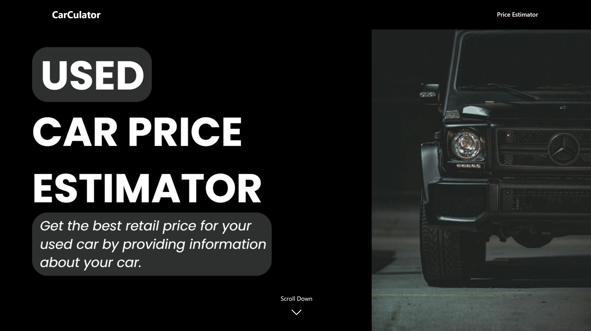
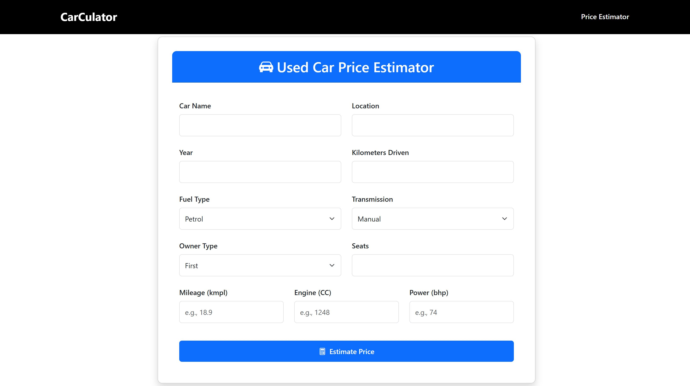

# CarCulator - Used Car Price Estimation System
This is a car price estimation project built using Python. It uses XGBoost Regressor Model to estimate the best price for used cars. The model is trained over a dataset with 6000+ rows and tested over a dataset with 1200+ rows. The model performs with a R² Score: 0.8986 and RMSE: 3.5318.

Checkout the training and testing of the model : [Check out the notebook](car_estimation.ipynb)

Checkout the datasets used for the model : [Check out the dataset](dataset)

## Technologies Used
 - Python (Flask, XG-Boost, pandas, numpy)
 - HTML
 - CSS
 - JavaScript
 - Bootstrap

## User-Interface
Home Screen

Estimation

